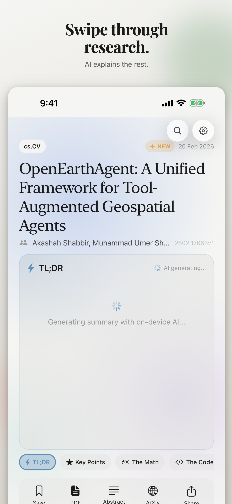
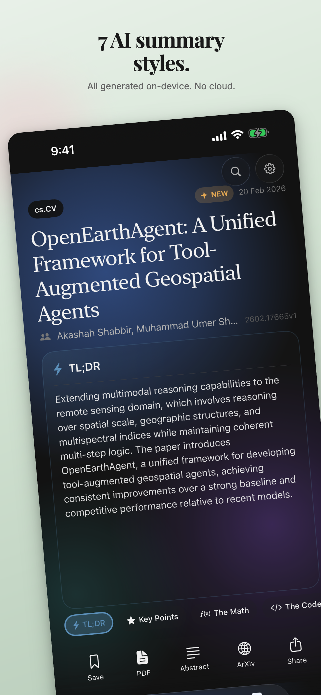
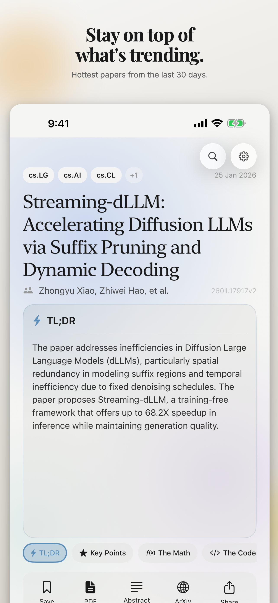
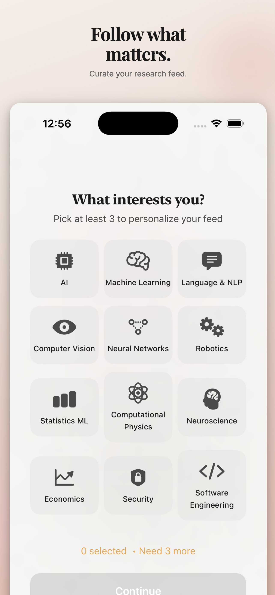
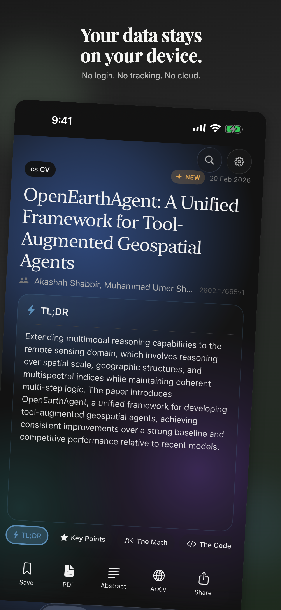
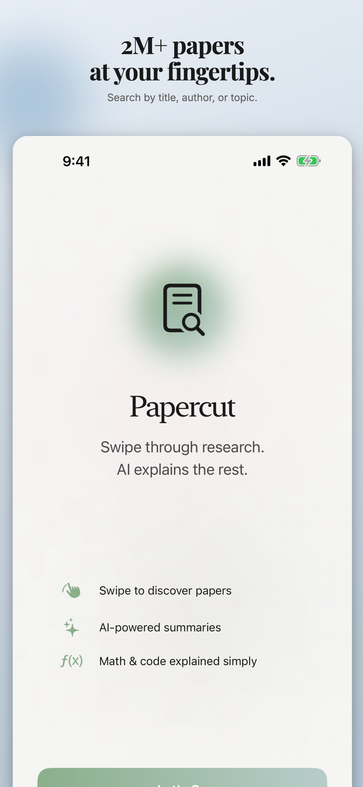

<p align="center">
  
</p>

<h1 align="center">Papercut</h1>

<p align="center">
  <strong>Research papers, distilled.</strong>
</p>

<p align="center">
  A beautiful, privacy-first research paper reader for iOS.<br/>
  Browse, search, and summarize papers from arXiv — entirely on-device.
</p>

<p align="center">
  No login. No tracking. No analytics. No cloud. Just papers.
</p>

<p align="center">
  <a href="https://apps.apple.com/us/app/papercut-research-distilled/id6759408514">
    
  </a>
</p>

<p align="center">
  
  
  
</p>
<p align="center">
  
  
  
</p>

---

## What is Papercut?

Papercut turns arXiv into a TikTok-style feed of research papers. One paper per screen. Swipe up to discover. Tap for AI-powered summaries. Everything happens on your device.

**Swipe up** through the latest and trending papers in your fields. **Tap for AI magic** — get TL;DRs, key findings, math explained, code walkthroughs, and more. **Track research topics** with persistent keyword-based feeds. **Search anything** across arXiv's 2M+ papers. **Save for later** with a double-tap.

Your reading habits, interests, and saved papers never leave your phone.

## Features

### Feed
- **Full-screen paper feed** — Swipe vertically through papers like a social feed. Each card shows title, authors, categories, and an AI summary.
- **Latest & Trending tabs** — Latest papers sorted by submission date. Trending papers from the last 30 days sorted by relevance.
- **New papers detection** — Pull to refresh prepends new papers above your current position. A pill shows how many new papers arrived, with snap-back to resume reading where you left off.
- **Scroll position persistence** — Your reading position is saved per tab and restored across app restarts.
- **Persistent bookmarks** — Double-tap any paper to bookmark. Bookmarked papers survive cache cleanup and appear in the Saved tab.

### Research Topics
- **Custom topic feeds** — Create keyword-based research topics (e.g., "RLHF", "diffusion models", "transformer efficiency") that act as persistent, auto-updating search feeds.
- **Per-topic sorting** — Sort each topic by relevance, newest, or oldest.
- **Topic management** — Add, remove, and browse topics from a dedicated tab.

### AI Summaries
- **On-device AI summaries** — 7 summary styles (TL;DR, Key Findings, Math Explained, Code Explained, Methodology, Implications, ELI5) generated entirely on-device using Apple Foundation Models. No API keys, no cloud processing.
- **Smart summarization queue** — Summaries are pre-generated in priority order: current paper first, then nearby papers, with intelligent priority demotion as you scroll.

### Search
- **Powerful search** — Full-text search across arXiv's 2M+ papers. Search by title, author, topic, or ArXiv ID.
- **Search sorting** — Sort results by relevance, newest first, or oldest first.
- **Category filtering** — Filter search results by arXiv categories.
- **Explore topics** — Quick-tap topic suggestions to kickstart your search.

### Notifications
- **Daily digest** — Configurable daily reminder at your chosen time.
- **Topic update alerts** — Get notified when new papers drop in your tracked topics.
- **New feed items** — Background checks for new papers in your followed categories.
- **Smart onboarding** — Notification setup explains why each type is useful before asking for permission.

### Customization
- **Category filtering** — Follow specific arXiv categories (cs.AI, math.CO, physics.gen-ph, etc.) to curate your feed.
- **Dark & light mode** — Warm neutral palette with full dark mode support. Liquid Glass UI on iOS 26.
- **Offline-ready** — Papers and summaries are cached locally in SwiftData.

## Privacy

Papercut is built on a simple principle: **your data stays on your device**.

- No user accounts or login
- No analytics or telemetry
- No tracking of any kind
- No data sent to any server (except arXiv API for fetching papers)
- AI summaries generated on-device via Apple Foundation Models
- All preferences, bookmarks, and cached data stored locally

## Requirements

- iOS 26.0+
- Xcode 26+
- iPhone with Apple Silicon (for on-device AI summaries)

## Getting Started

1. Clone the repo:
   ```bash
   git clone https://github.com/rajatady/Papercut.git
   ```
2. Open `Papercut.xcodeproj` in Xcode
3. Select your device or simulator
4. Build and run

No API keys, no configuration, no `.env` files. It just works.

## Architecture

```
Papercut/
├── Models/            # SwiftData models (Paper, Summary, Topic, Author, Category)
├── Features/
│   ├── Feed/          # Main feed, full-screen cards, search, state machine
│   ├── Topics/        # Topic list, detail view, add topic sheet
│   ├── Onboarding/    # Category selection + notification setup
│   ├── Settings/      # App settings, category picker, summary styles
│   └── Feedback/      # In-app feedback with animated UI
├── Components/        # Reusable views (badges, chips, pills, pickers)
├── Services/
│   ├── ArXiv/         # ArXiv API client, XML parser, endpoints
│   ├── Summarization/ # On-device AI with @Generable schemas
│   ├── Notifications/ # Local notification scheduling + types
│   ├── Background/    # BGAppRefreshTask checkers for topics + feed
│   ├── Repositories/  # Data layer (PaperRepository, TopicRepository, PreferencesStore)
│   └── Storage/       # Local summary cache
└── Theme/             # Design system (colors, typography, spacing, animations)
```

**Key design decisions:**
- **Pure state machine** — Feed uses a deterministic `TabStateMachine` with typed events and side effects. Each tab owns independent state. 97+ tests cover transitions and invariants.
- **SwiftData** for persistence — papers, summaries, topics, and bookmarks
- **`@Observable` view models** with `@MainActor` isolation
- **`@Generable` structured output** — AI summaries use Apple's constrained decoding for guaranteed clean output (no markdown, no emojis, controlled length)
- **Priority-based summarization queue** — critical/high/medium/low priorities with automatic demotion
- **Background task infrastructure** — `BGAppRefreshTask` for topic and feed update checks with per-topic notifications

## Testing

372 tests covering:
- State machine transitions and invariants
- ViewModel integration tests
- Repository CRUD operations
- Topic management
- Notification preferences and backward compatibility
- Background task configuration

```bash
xcodebuild test -scheme Papercut -destination "platform=iOS Simulator,name=iPhone 17 Pro" -parallel-testing-enabled NO
```

## Contributing

Contributions are welcome! Please feel free to submit issues and pull requests.

- [Report a Bug](https://github.com/rajatady/Papercut/issues/new?labels=bug)
- [Request a Feature](https://github.com/rajatady/Papercut/issues/new?labels=enhancement)

## License

MIT License. See [LICENSE](LICENSE) for details.

---

<p align="center">
  Built with SwiftUI, SwiftData, and Apple Foundation Models.
</p>
